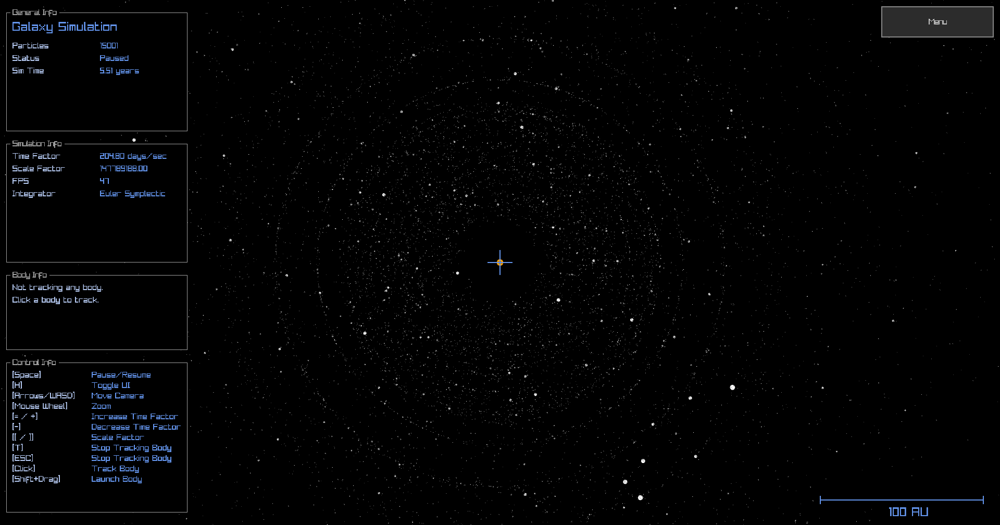
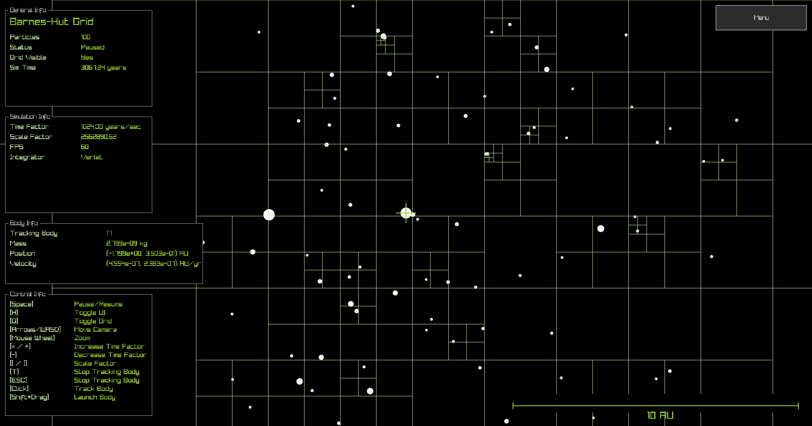
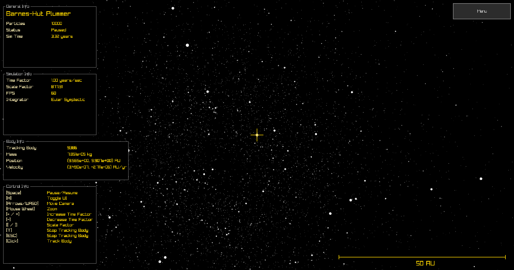
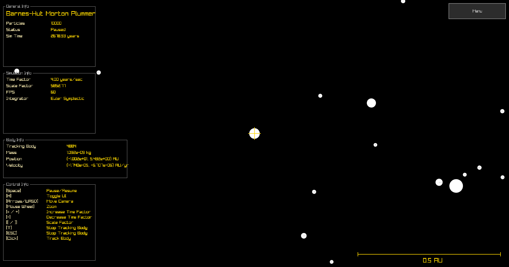
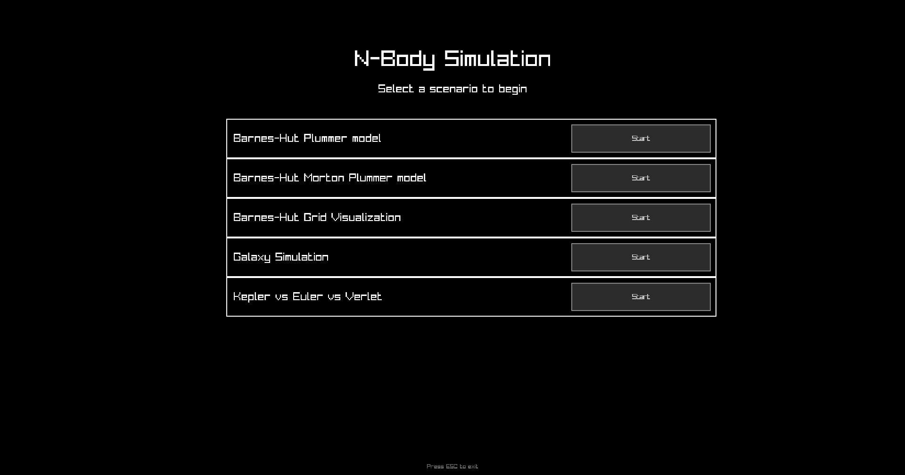
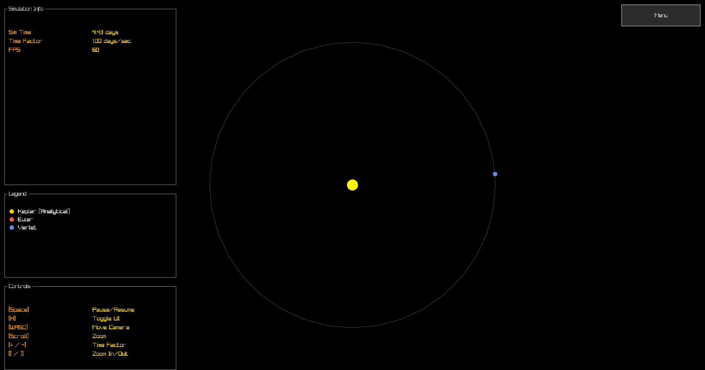

# NBody

**NBody-cpp** is a fast, interactive 2D n-body simulation written in modern C++.
It features multiple algorithms for gravitational dynamics, including Barnes-Hut implementation, and provides real-time visualization using Raylib.



## Features

- Direct O(N²) and Barnes-Hut (O(N log N)) algorithms
- Barnes-Hut variant with Morton codes and radix sort
- Analytical two-body (Kepler) solution
- Interactive camera and UI (Raylib + Raygui)
- Multiple preset scenarios (galaxy, solar system, grid, globular cluster distribution)
- Configurable simulation parameters
- Benchmarks and tests

## Build & Run

**Dependencies:**

- **CMake** (>= 3.13)
- **C++23** compiler (MSVC, Clang, or GCC)
- **Raylib** (system or autofetched)
- **Raygui** (system or autofetched)
- **Doctest** (system or autofetched)
- **Nanobench** (system or autofetched)

**Quick start (Debug):**

```bash
cmake -B build
cmake --build build
./build/apps/nbody
```

**Production build (optimized):**

```bash
cmake -B build -DCMAKE_BUILD_TYPE=Production
cmake --build build
./build/apps/nbody
```

For more details, see the Polish documentation:
[`docs/dokumentacja.md`](docs/dokumentacja.md)

# Gallery







